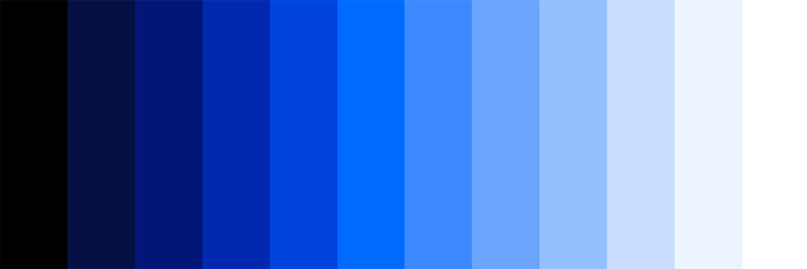

import HomepageTemplate from '../components/Homepage.js';
export default HomepageTemplate;

## Browse by topic
 
<CardGroup>
  <MiniCard title="Mining Basics" href="#" actionIcon="arrowRight" />
  <MiniCard title="Braiins Insights" href="#" actionIcon="arrowRight" />
  <MiniCard title="Braiins OS+" href="#" actionIcon="arrowRight" />
  <MiniCard title="Farm Proxy" href="#" actionIcon="arrowRight" />
  <MiniCard title="Farm Toolbox" href="#" actionIcon="arrowRight" />
  <MiniCard title="Farm Monitor" href="#" actionIcon="arrowRight" />
  <MiniCard title="Braiins Pool" href="#" actionIcon="arrowRight" />
  <MiniCard title="Tools & Processes" href="#" actionIcon="arrowRight" />
</CardGroup>

<FeatureCard
    color="dark"
    href="/getting-started"
    title="Webinars"
    actionIcon="arrowRight"
    className="homepage-feature"
    >

<ArtDirection>

</ArtDirection>

</FeatureCard>

## Featured Webinars
 
<Row>
  <Column colMd={4} colLg={4} noGutterMdLeft>
    <ArticleCard
      title="Farm Proxy: Installation and Configuration"
      readTime="13 minutes"
      href="#">
      

    </ArticleCard>

  </Column>
  <Column colMd={4} colLg={4} noGutterMdLeft>
    <ArticleCard
      title="Farm Proxy: Installation and Configuration"
      readTime="13 minutes"
      href="#">
      

    </ArticleCard>

  </Column>
  <Column colMd={4} colLg={4} noGutterMdLeft>
    <ArticleCard
      title="Farm Proxy: Installation and Configuration"
      readTime="13 minutes"
      href="#">
      

    </ArticleCard>

  </Column>
</Row>

## Braiins Full-Stack Mining Solution
<iframe width="560" height="315" src="https://www.youtube.com/embed/AXfyDhbx4WY" title="YouTube video player" frameborder="0" allow="accelerometer; autoplay; clipboard-write; encrypted-media; gyroscope; picture-in-picture" allowfullscreen></iframe>

## Have Questions?
Our dev and support teams are always available to help.

<Column colMd={4} colLg={4} noGutterSm>
  <ResourceCard
    subTitle="View our Telegram group"
    actionIcon="arrowRight"
    aspectRatio="2:1"
    href="[https://gatsby-theme-carbon.now.sh](https://t.me/BraiinsOS)">
  </ResourceCard>
  <ResourceCard
    subTitle="Contact Support"
    actionIcon="arrowRight"
    aspectRatio="2:1"
    href="[https://gatsby-theme-carbon.now.sh](https://t.me/BraiinsOS)">
  </ResourceCard>
  <ResourceCard
    subTitle="Give us Feedback and upvote product ideas"
    actionIcon="arrowRight"
    aspectRatio="2:1"
    href="[https://gatsby-theme-carbon.now.sh](https://t.me/BraiinsOS)">
  </ResourceCard>
</Column>
